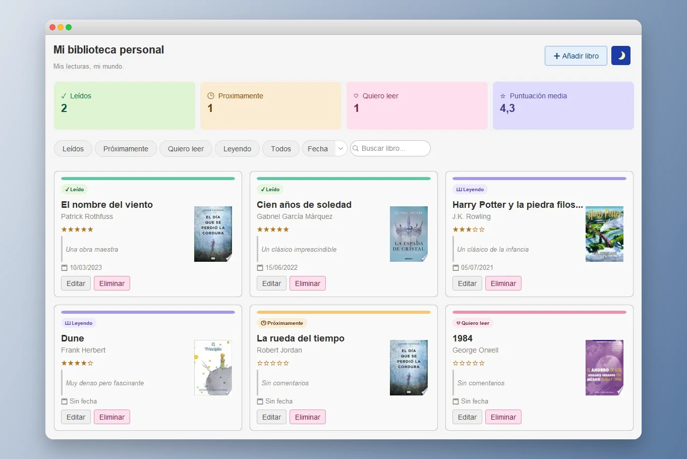
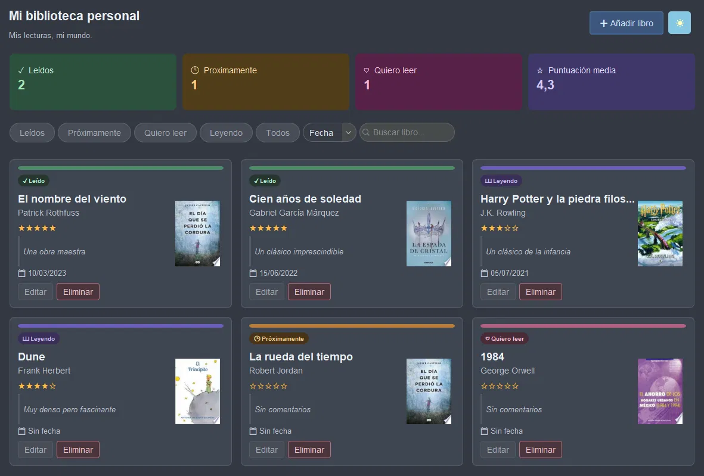

# 📚 Mi Biblioteca Personal

## 🎓 Origen del proyecto

Esta app nació como un ejercicio de preparación para el examen final de Java de 1º, donde practiqué la persistencia de datos en ficheros de texto con Swing por un lado, y por otro persistencia con BBDD. El ejercicio original era una biblioteca básica con operaciones CRUD sobre un `.txt` y una interfaz por defecto de Swing, con campos simples como título, autor, género y estado (leído/pendiente).

Después del examen, lo retomé como proyecto personal para explorar cómo construir una interfaz moderna en Java partiendo de ese ejercicio base: integración con la API de Google Books para portadas y autocompletado de autor, modo oscuro, caché local de imágenes, búsqueda y filtros, y un diseño con FlatLaf y Nunito. No tenía nada que ver con el Swing por defecto que vi en clase, y ahora ¡así esto sí que mola!

En definitiva, es una aplicación de escritorio en Java para gestionar las lecturas personales. Añade, edita y organiza tus libros con un diseño moderno y colorido, en temas claro y oscuro.





---

## ✨ Características

- **Gestión completa de libros** — añade, edita y elimina libros fácilmente
- **Estados de lectura** — clasifica tus libros como Leído, Leyendo, Próximamente o Quiero leer
- **Portadas automáticas** — obtiene la portada del libro automáticamente desde Google Books
- **Autocompletado de autor** — al escribir el título sugiere el autor automáticamente
- **Filtros y búsqueda** — filtra por estado y busca por título o autor
- **Ordenación** — ordena por fecha de lectura o por título
- **Puntuación y notas** — puntúa tus libros y añade notas personales
- **Estadísticas** — ve de un vistazo cuántos libros llevas leídos y tu puntuación media
- **Modo oscuro** — cambia entre modo claro y oscuro con un clic
- **Portadas en caché** — las portadas se guardan localmente para cargar más rápido

---

## 🖥️ Requisitos

- Java 17 o superior
- Conexión a internet (para cargar portadas y autocompletar autores)

---

## 🚀 Instalación y uso

1. Descarga el archivo `.jar` de la carpeta `target/` y el `config.properties.example` de la raíz del repositorio
2. Renombra `config.properties.example` a `config.properties`
3. Abre el fichero y añade tu API key de Google Books (ver sección siguiente)
4. Coloca el `.jar` y el `config.properties` en la misma carpeta
5. Haz doble clic en el `.jar` para ejecutar la aplicación

> Si el doble clic no funciona, abre una terminal en esa carpeta y ejecuta:
> ```bash
> java -jar labiblioteca-1.0-SNAPSHOT-jar-with-dependencies.jar
> ```

---

## 🔑 API Key de Google Books

La aplicación usa la API de Google Books para obtener portadas y autores automáticamente. El archivo `config.properties` contiene la clave necesaria.

Si quieres usar tu propia clave gratuita:

1. Ve a [Google Cloud Console](https://console.cloud.google.com)
2. Crea un proyecto nuevo
3. Activa la **Books API** en "APIs y servicios" → "Biblioteca"
4. Genera una clave en "APIs y servicios" → "Credenciales" → "Crear credenciales" → "Clave de API"
5. Edita el archivo `config.properties` y sustituye el valor:

```properties
google.books.api.key=TU_API_KEY_AQUI
```

---

## 📁 Estructura del proyecto

```
src/main/java/com/prog/
├── Main.java                  # Punto de entrada
├── data/
│   ├── BookFile.java          # Persistencia en fichero de texto
│   └── BookCoverFetcher.java  # Integración con Google Books API
├── model/
│   └── Book.java              # Modelo de datos
├── ui/
│   ├── Window.java            # Ventana principal
│   ├── BookCard.java          # Tarjeta de libro
│   └── AddBookDialog.java     # Diálogo de añadir/editar
└── utils/
    ├── UIUtils.java           # Componentes reutilizables
    ├── ThemeColors.java       # Colores del tema claro/oscuro
    └── WrapLayout.java        # Layout con wrap automático
```

---

## 🛠️ Tecnologías

- **Java 17**
- **Swing** — interfaz gráfica
- **FlatLaf 3.4** — tema moderno para Swing
- **Gson 2.10** — parseo de JSON para la API
- **Google Books API** — portadas y metadatos de libros
- **Maven** — gestión de dependencias

---

## 📖 Datos almacenados

Los libros se guardan en un archivo `books.txt` en la misma carpeta que el `.jar`, en formato de texto plano separado por comas. Las portadas se cachean localmente en una carpeta `cache/`.

---

## 📄 Licencia

Proyecto personal de uso libre.